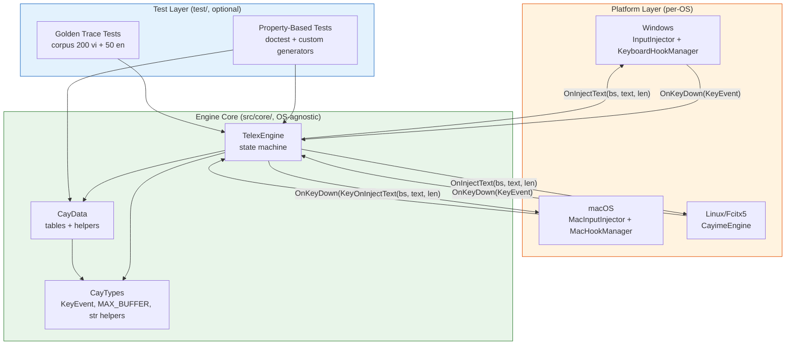
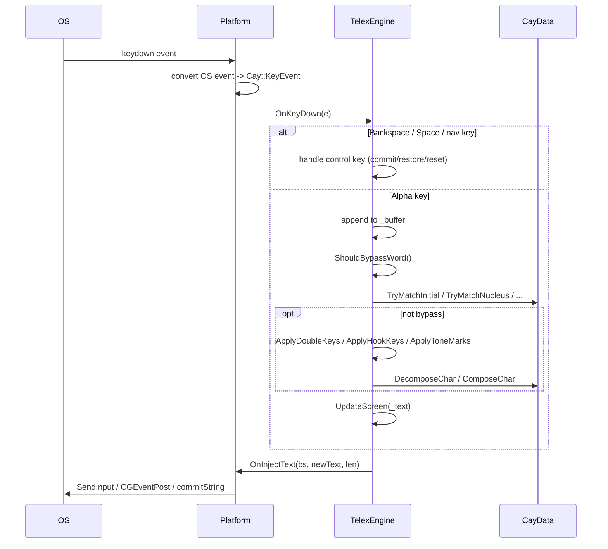

# Design Document — Engine Core Refactor

## Overview

Tài liệu này mô tả thiết kế cho đợt refactor `src/core/` của Cay (bộ gõ Telex tiếng Việt C++ thuần, đa nền tảng). Mục tiêu là cải thiện chất lượng nội tại của Engine_Core mà **không thay đổi hành vi** ở góc nhìn người dùng cuối: cùng một chuỗi phím Telex phải sinh ra cùng một chuỗi Unicode.

### Goals

1. **Single source of truth** cho 4 bảng âm tiết tiếng Việt (initials, nuclei, finals, tails) — chỉ tồn tại tại đúng MỘT vị trí trong `CayData.cpp`.
2. **Loại bỏ code lặp** — block `for (int t = 1; t <= 5; t++)` đếm tone hiện tại đang lặp >10 lần trong `CayEngine.cpp`. Sau refactor: tối đa 1 lần.
3. **Helper API rõ ràng** trên CayData: `DecomposeChar`, `ComposeChar`, `TryMatchInitial`, `TryMatchNucleus`, `TryMatchFinal`, `TryMatchTail`.
4. **Dọn dữ liệu sai** trong `s_nuclei` (xoá `ăn`, `yi`, `yo`, `yu`, `ou`, duplicate `âu`) và duplicate `dd`/`đ` trong `s_initials`.
5. **Thống nhất `MAX_BUFFER`** — di chuyển từ macro `#define` ở `CayData.h` sang `constexpr` ở `CayTypes.h`. Cập nhật `MacInputInjector`.
6. **Sửa mojibake** trong comment `CayEngine.cpp` — đảm bảo file UTF-8 không BOM.
7. **Bộ test Property-Based** mới (binary tách riêng, có thể dùng STL) để đặt baseline behavior + verify các property cốt lõi.

### Non-Goals

- **Không** thay đổi hành vi engine từ góc nhìn người dùng (Behavioral_Equivalence là invariant cứng).
- **Không** thay đổi public API mà platform layer đang phụ thuộc (`OnKeyDown`, `OnKeyUp`, `ResetFull`, `OnInjectText`, `KeyEvent`).
- **Không** mở rộng phạm vi sang fcitx5 logic xử lý text (chỉ document terminal-list, không sửa lifecycle).
- **Không** đổi quy tắc Telex (vẫn là Telex chuẩn — không thêm "VNI", không thêm hotkey mới).
- **Không** vi phạm ràng buộc no-CRT/no-STL/no-allocation/no-exception trong `src/core/`.

### Success Criteria

| Tiêu chí | Cách đo |
|---|---|
| Behavioral_Equivalence | Golden test corpus 200 từ Việt + 50 từ Anh, diff `OnInjectText` trace giữa baseline-commit và HEAD = 0 |
| Code lặp giảm | `grep -c "for (int t = 1; t <= 5; t++)" src/core/CayEngine.cpp` ≤ 1 |
| Single source of truth | `grep -n "s_initials\|s_nuclei\|s_finals\|s_tails" src/core/*.cpp` chỉ có 1 file (CayData.cpp) |
| Binary size | `cay.exe`, `cay.app/cay`, `libcayime.so` ≤ 110% baseline (mục tiêu ≤ 100%) |
| PBT pass rate | 100% property tests pass với ≥ 100 iterations mỗi property |
| No-CRT preservation | Build Windows Release với `/EHs-c- /GR- /NODEFAULTLIB:msvcrt.lib` thành công |

---

## Architecture

### Tổng quan các tầng



### Luồng xử lý một keystroke (giữ nguyên sau refactor)



### Quy tắc kiến trúc bất biến

1. **No-CRT / No-STL trong `src/core/`** — Engine_Core chỉ dùng `wchar_t`, `int`, helper trong `CayTypes.h` (`CayStrLen`, `CayStrCmp`). Không include `<vector>`, `<string>`, `<algorithm>`, ...
2. **No allocation trong Hot_Path** — Tất cả buffer là array stack/static (`MAX_BUFFER`).
3. **No exception** — Không `throw`, không `try/catch`. Build với `/EHs-c-`.
4. **Backward-scan** — Mọi modifier (double, hook, tone) áp dụng bằng cách scan `_text[]` từ cuối về đầu (QUY TẮC 3).
5. **Single source of truth** — Sau refactor, mỗi bảng (initials/nuclei/finals/tails) tồn tại tại đúng MỘT nơi.

---

## Components and Interfaces

### `CayData` — API mới (single source of truth)

CayData sẽ expose 3 nhóm API. Nhóm 1 (validate) đã có; nhóm 2 (decompose/compose) và nhóm 3 (match) là mới.

#### Nhóm 1 — Validation (giữ nguyên signature, dọn nội bộ)

```cpp
// API public hiện hành — không thay đổi signature
static bool    IsValidInitial(const wchar_t* s, int len);
static bool    IsValidNucleus(const wchar_t* s, int len);
static int     GetToneIndex(wchar_t key);              // z=0,f=1,s=2,r=3,x=4,j=5, -1 nếu không phải phím dấu
static wchar_t GetToneMark(wchar_t base, int toneIndex); // 0 nếu không có mapping
static bool    HasVietnameseMark(wchar_t ch);
static bool    HasVietnameseMark(const wchar_t* buf, int len);
static wchar_t StripTone(wchar_t ch);
static wchar_t StripAccent(wchar_t ch);
static bool    IsVowel(wchar_t ch);
static wchar_t GetHookRule(wchar_t c);
```

#### Nhóm 2 — Decompose / Compose (MỚI, giải quyết Requirement 4)

Đây là helper trung tâm để loại bỏ pattern lặp `for (int t = 1; t <= 5; t++)`.

```cpp
// Kết quả phân rã 1 ký tự nguyên âm có dấu thành 3 phần
struct DecomposedChar {
    wchar_t base;       // Nguyên âm cơ bản đã StripAccent + StripTone, viết thường (a,e,i,o,u,y)
                        // hoặc nguyên âm có dấu mũ/móc đã StripTone, viết thường (â,ă,ê,ô,ơ,ư)
                        // Nói cách khác: GIỮ dấu mũ/móc, BỎ dấu thanh, BỎ uppercase
    int     toneIndex;  // 0..5 (0 = không dấu)
    bool    isUpper;    // True nếu ký tự gốc là chữ hoa
};

// Tách ký tự `c` thành (base_không_dấu_thanh, toneIndex, isUpper)
// Complexity: O(1) — single switch, không vòng for
// Pre: c là ký tự nguyên âm bất kỳ (thuần hoặc có dấu) hoặc d/đ
// Post: ComposeChar(Decompose(c)) == c (Round_Trip_Property)
static DecomposedChar DecomposeChar(wchar_t c);

// Ghép (base, toneIndex, isUpper) trở lại ký tự có dấu
// Complexity: O(1)
// Pre: base là nguyên âm thuần hoặc có mũ/móc, viết thường; toneIndex 0..5
// Post: nếu isUpper -> ToUpperViet(GetToneMark(base, toneIndex))
//        ngược lại -> GetToneMark(base, toneIndex)
//        nếu toneIndex == 0 và isUpper -> ToUpperViet(base)
static wchar_t ComposeChar(wchar_t base, int toneIndex, bool isUpper);

// Helper case conversion — đã tồn tại trong CayEngine.cpp dưới dạng static, di chuyển lên CayData
static wchar_t ToLowerViet(wchar_t c);
static wchar_t ToUpperViet(wchar_t c);
```

**Ghi chú implementation**: `DecomposeChar` thực hiện 3 bước O(1):
1. `isUpper = (ToLowerViet(c) != c) || (c trong A..Z)`
2. `clo = ToLowerViet(c)` rồi `clean = StripTone(clo)` — `StripTone` là switch, O(1)
3. `toneIndex` được tính bằng switch trên `clo` (không phải vòng for) — vì mỗi codepoint Unicode cho ký tự có dấu là duy nhất, ta biết tone của nó tại compile-time

→ Pseudocode minh hoạ logic switch (chi tiết đầy đủ sẽ ở phase tasks):

```cpp
DecomposedChar CayData::DecomposeChar(wchar_t c) {
    DecomposedChar r;
    r.isUpper   = (c != ToLowerViet(c));
    wchar_t lo  = ToLowerViet(c);
    r.toneIndex = LookupToneIndex(lo);   // switch O(1) — bảng "ch -> toneIdx"
    r.base      = StripTone(lo);          // switch O(1)
    return r;
}
```

`LookupToneIndex` là một static helper riêng (không expose) — switch case 60 nhánh cho 12 nguyên âm × 5 tone, trả 0 cho mọi ký tự khác.

#### Nhóm 3 — Match Tables (MỚI, giải quyết Requirement 2)

Để `IsCompleteSyllable` không cần khai báo lại tables, CayData expose 4 helper match. Mỗi helper trả về độ dài match dài nhất từ vị trí đầu chuỗi (hoặc 0 nếu không match).

```cpp
// Match phụ âm đầu dài nhất ở đầu `s` (longest-prefix-match).
// Returns: số wchar_t đã match, 0 nếu không có (cụm rỗng vẫn được coi là không match — caller xử lý).
// Complexity: O(N) với N = số entry trong bảng (≈ 28).
// Bảng được sắp xếp dài-trước trong CayData để đảm bảo longest match.
static int TryMatchInitial(const wchar_t* s, int len);

// Match nhân nguyên âm dài nhất.
// Bảng nuclei dùng UTF-16 với escape \u (â=\u00E2 ...). Caller phải đã chuẩn hoá s
// về dạng tone-stripped (chỉ có dấu mũ/móc, không có dấu thanh).
static int TryMatchNucleus(const wchar_t* s, int len);

// Match phụ âm cuối (c, ch, m, n, ng, nh, p, t — và rỗng).
static int TryMatchFinal(const wchar_t* s, int len);

// Match vần phụ (i, y, o, u — và rỗng).
static int TryMatchTail(const wchar_t* s, int len);
```

**Lý do chọn `TryMatch*` thay vì `GetXxxAt(idx) + Count`**: API `TryMatch*` đặt logic longest-prefix-match vào CayData (đúng nơi tables sống), không đẩy chi tiết "duyệt theo thứ tự nào" lên `IsCompleteSyllable`. Caller chỉ cần tăng `pos` theo giá trị trả về. Đây là Tell-Don't-Ask phù hợp single source of truth.

### `TelexEngine` — sau refactor

Public API **không đổi** (platform layer phụ thuộc):

```cpp
class TelexEngine {
public:
    TelexEngine();
    void OnKeyDown(Cay::KeyEvent& e);
    void OnKeyUp(Cay::KeyEvent& e);              // giữ no-op + comment lý do (platform contract)
    void ResetFull();
    void CommitWord();
    InjectTextFunc OnInjectText = nullptr;
private:
    // ... fields giữ nguyên: _buffer, _text, _lastOutput, _saved*, _toneIndex, _canRestore
    // private methods: ApplyDoubleKeys, ApplyHookKeys, ApplyToneMarks, ...
};
```

Các method private được rewrite để dùng `CayData::DecomposeChar` / `ComposeChar`:

```cpp
// TRƯỚC refactor (lặp ~10 lần):
//   for (int t = 1; t <= 5; t++) {
//     if (CayData::GetToneMark(baseTarget, t) == target || ...) { tone = t; break; }
//   }
//   bool isUpper = ...;
//   wchar_t baseTarget = CayData::StripTone(target);

// SAU refactor (1 dòng):
//   auto d = CayData::DecomposeChar(target);
//   // d.base, d.toneIndex, d.isUpper sẵn dùng

bool TelexEngine::ApplyDoubleKeys(wchar_t key) {
    wchar_t loKey = CayData::ToLowerViet(key);
    if (loKey != L'a' && loKey != L'e' && loKey != L'o' && loKey != L'd') return false;

    for (int j = _textLen - 1; j >= 0; j--) {
        auto d = CayData::DecomposeChar(_text[j]);   // <-- THAY for(t=1..5)
        // ... logic undo + apply, rồi:
        // _text[j] = CayData::ComposeChar(newBase, d.toneIndex, d.isUpper);
        // ...
    }
    return false;
}
```

Tương tự cho `ApplyHookKeys`, `ApplyToneMarks`. Điều này giảm `for (int t = 1; t <= 5; t++)` từ >10 lần xuống 0 lần (mục tiêu Requirement 4.7 là ≤ 1 — đạt thừa).

### `IsCompleteSyllable` — sau refactor

`IsCompleteSyllable` di chuyển từ static function trong `CayEngine.cpp` sang **vẫn ở CayEngine.cpp** (vì nó là logic engine, không phải data) NHƯNG **không khai báo lại tables**. Thay vào đó dùng `CayData::TryMatch*`:

```cpp
static bool IsCompleteSyllable(const wchar_t* s, int len) {
    if (len <= 0 || len > 20) return false;

    int pos = 0;

    // Block 1: phụ âm đầu (có thể rỗng)
    int initialLen = CayData::TryMatchInitial(s + pos, len - pos);
    pos += initialLen;
    // Special case "gi" — giữ nguyên logic rollback hiện tại
    if (initialLen == 2 && s[0] == L'g' && s[1] == L'i') {
        if (pos == len || !CayData::IsVowel(s[pos])) {
            pos--;  // rollback: 'i' là nucleus
        }
    }

    // Block 2: nhân nguyên âm (bắt buộc)
    int nucleusLen = CayData::TryMatchNucleus(s + pos, len - pos);
    if (nucleusLen == 0) return false;
    const wchar_t* nucleus = s + pos;
    pos += nucleusLen;

    // Block 3: phụ âm cuối (tuỳ chọn) + Nucleus-Final Pairing Rule
    int finalLen = CayData::TryMatchFinal(s + pos, len - pos);
    if (finalLen > 0) {
        // ... áp dụng pairing rule trên (nucleus, final) — rule giữ nguyên
        pos += finalLen;
    }

    // Block 4: vần phụ (tuỳ chọn)
    pos += CayData::TryMatchTail(s + pos, len - pos);

    return pos == len;
}
```

Logic `Nucleus-Final Pairing Rule` (nh/ch chỉ đi với a/i/ê/y/oa/uy/uê; ng/c không đi với i/ê/y) giữ nguyên trong `CayEngine.cpp` vì đó là quy tắc tiếng Việt, không phải data.

### Platform Layer — thay đổi tối thiểu

| File | Thay đổi |
|---|---|
| `src/platform/macos/MacInputInjector.mm` | Thay `UniChar chars[64]` bằng `UniChar chars[Cay::MAX_BUFFER]`. Include `CayTypes.h`. |
| `src/platform/windows/InputInjector.cpp` | Giữ `INPUT inputs[256]` nhưng thêm comment giải thích vì sao 256 (= 1 dummy + 64 bs + 128 unicode pairs ×2 ≈ headroom). |
| `src/platform/fcitx5/CayimeEngine.cpp` | Document terminal-list (Requirement 16) — chuyển string-find chain thành const array `g_terminalProgramNames` ở đầu file. Giữ logic cũ. |

Không thay đổi `KeyboardHookManager.cpp`, `MacHookManager.mm`, `main.cpp`, `AppDelegate.mm`.

### `CayTypes.h` — thêm `MAX_BUFFER`

```cpp
namespace Cay {
    constexpr int MAX_BUFFER = 64;        // <-- MỚI, single source

    enum class KeyCode : uint32_t { ... };
    struct KeyEvent { ... };
    typedef void (*InjectTextFunc)(int, const wchar_t*, int);
    inline int CayStrLen(const wchar_t*);
    inline int CayStrCmp(const wchar_t*, const wchar_t*);
}
```

`CayData.h` sẽ bỏ `#define MAX_BUFFER 64` và include `CayTypes.h` (đã có sẵn). `CayEngine.h` đã include `CayData.h` → tự động có MAX_BUFFER qua chain.

---

## Data Models

### Tables nội bộ trong `CayData.cpp`

Tất cả tables là `static const` ở namespace scope của `CayData.cpp`, nằm trong `.rdata` (read-only segment), không cấp phát động. Sắp xếp **dài-trước** để longest-prefix-match đúng.

#### `s_initials` — sạch sau refactor

```cpp
// Sau refactor (xoá duplicate "dd" / "đ" — chỉ giữ MỘT, dùng "đ" Unicode)
static const wchar_t* const s_initials[] = {
    // Length 3
    L"ngh",
    // Length 2
    L"ch", L"gh", L"gi", L"kh", L"ng", L"nh", L"ph", L"qu", L"th", L"tr",
    // Length 1
    L"b", L"c", L"d", L"\u0111", L"g", L"h", L"k", L"l", L"m", L"n",
    L"p", L"r", L"s", L"t", L"v", L"x"
};
// Total: 26 entries (giảm 2 từ baseline 28)
```

**Lý do giữ `\u0111` (đ) và `d` riêng biệt**: Telex cho phép gõ trực tiếp ký tự `đ` (ví dụ qua copy-paste) HOẶC qua `dd`. Bảng phải nhận cả hai dạng vì `IsCompleteSyllable` được gọi trên `_text` (đã transform), trong đó `dd` đã trở thành `đ`.

**Tại sao xoá entry `dd`**: Khi engine gọi `IsCompleteSyllable(textLo, len)` (line ~270 CayEngine.cpp hiện tại), `textLo` đã là `_text` đã được `StripTone` + `ToLowerViet`. Tại thời điểm đó, `dd` đã được `ApplyDoubleKeys` chuyển thành `\u0111`. Vì vậy `dd` trong `s_initials` không bao giờ được match thực tế → dead entry.

#### `s_nuclei` — dọn rác sau refactor

```cpp
// Sau refactor: 39 entries (giảm 5 từ baseline 44, dùng \u escape thay vì literal UTF-8)
static const wchar_t* const s_nuclei[] = {
    // 3 nguyên âm
    L"i\u00eau",      // iêu
    L"y\u00eau",      // yêu
    L"\u01b0\u01a1u", // ươu
    L"u\u00f4i",      // uôi
    L"\u01b0\u01a1i", // ươi
    L"oai", L"oay",
    L"uya", L"uy\u00ea",  // uya, uyê
    L"oao", L"oeo", L"uyu", L"uye",
    L"ieu", L"yeu", L"uoi", L"uou",   // ASCII Telex (chưa transform)

    // 2 nguyên âm
    L"ai", L"ao", L"au", L"ay",
    L"\u00e2u", L"\u00e2y",           // âu, ây
    L"eo", L"\u00eau",                // eo, êu
    L"ia", L"i\u00ea", L"ie", L"iu", // ia, iê, ie, iu
    L"oa", L"o\u0103", L"oe", L"oi", L"oo",  // oa, oă, oe, oi, oo
    L"\u00f4i",                        // ôi
    L"\u01a1i",                        // ơi
    L"ua", L"u\u00e2", L"u\u00ea", L"ui", L"u\u00f4", L"uy", L"uo", L"ue",
    L"\u01b0a", L"\u01b0i", L"\u01b0u", L"\u01b0\u01a1",  // ưa, ưi, ưu, ươ
    L"ya", L"y\u00ea", L"ye",          // ya, yê, ye

    // 1 nguyên âm
    L"a", L"\u0103", L"\u00e2",        // a, ă, â
    L"e", L"\u00ea",                    // e, ê
    L"i",
    L"o", L"\u00f4", L"\u01a1",        // o, ô, ơ
    L"u", L"\u01b0",                    // u, ư
    L"y"
};
// REMOVED: "ăn" (vần có phụ âm cuối, không phải nucleus)
// REMOVED: "yi", "yo", "yu", "ou" (không hợp lệ tiếng Việt)
// REMOVED: duplicate "âu" (chỉ giữ 1)
```

**Quan trọng — convention encoding**: Toàn bộ literal Unicode dùng `\uXXXX` escape thay vì ký tự UTF-8 raw trong source. Lý do:
- An toàn với mọi compiler / mọi locale (MSVC + cl.exe có quirks với /utf-8 trên Windows no-CRT build)
- Tách biệt với vấn đề mojibake ở comment (Requirement 15)
- Dễ grep/diff khi debug

#### `s_finals` — MỚI, di chuyển từ `IsCompleteSyllable`

```cpp
static const wchar_t* const s_finals[] = {
    L"ng", L"nh", L"ch",   // length 2 trước
    L"c", L"m", L"n", L"p", L"t"  // length 1 sau
};
// Total: 8 entries
// "rỗng" (no final consonant) được biểu diễn bằng TryMatchFinal trả 0 — không cần entry rỗng.
```

#### `s_tails` — MỚI

```cpp
static const wchar_t* const s_tails[] = {
    L"i", L"y", L"o", L"u"
};
// Total: 4 entries
```

#### Tone-mark sub-arrays — không đổi

`s_toneA`, `s_toneAc`, `s_toneAb`, `s_toneE`, `s_toneEc`, `s_toneI`, `s_toneO`, `s_toneOc`, `s_toneOh`, `s_toneU`, `s_toneUh`, `s_toneY` giữ nguyên — chúng đã là `wchar_t[6]` nhỏ gọn, không có rác.

#### `s_toneIndexLookup` — MỚI (cho `DecomposeChar`)

Để `DecomposeChar` chạy O(1) không vòng for, cần một lookup ngược. Triển khai bằng switch (compiler MSVC/clang sẽ tối ưu thành jump table):

```cpp
// Pseudocode — ở phase tasks sẽ là switch chi tiết.
// Logic: ký tự có dấu mỗi dấu mỗi codepoint duy nhất, biết-trước-compile-time.
static int LookupToneIndex(wchar_t c_lower) {
    switch (c_lower) {
        case L'\u00E0': /* à */ case L'\u1EA7': case L'\u1EB1':
        case L'\u00E8': case L'\u1EC1': case L'\u00EC':
        case L'\u00F2': case L'\u1ED3': case L'\u1EDD':
        case L'\u00F9': case L'\u1EEB': case L'\u1EF3':
            return 1;  // huyền

        case L'\u00E1': case L'\u1EA5': case L'\u1EAF':
        // ... (tương tự cho 5 tones còn lại)
            return 2;  // sắc

        // ... 3 (hỏi), 4 (ngã), 5 (nặng)

        default:
            return 0;  // không có dấu thanh
    }
}
```

Đây là switch ~60 case, compiler-friendly, không vi phạm no-CRT.

### `MyKey` — không đổi

```cpp
struct MyKey {
    wchar_t raw;       // Phím thô user gõ
    wchar_t output;    // Ký tự hiện tại trong _text (sau transform)
};
```

### `DecomposedChar` — MỚI

```cpp
struct DecomposedChar {
    wchar_t base;       // Nguyên âm cơ bản (đã StripTone, viết thường) — giữ dấu mũ/móc
    int     toneIndex;  // 0..5
    bool    isUpper;    // True nếu ký tự gốc là chữ hoa
};
```

Trivial POD (3 members ≤ 8 bytes), pass by value an toàn, không heap, không CRT.

---

## Correctness Properties

*Property là một đặc trưng hoặc hành vi phải đúng trên mọi thực thi hợp lệ của hệ thống — về bản chất là một mệnh đề hình thức về việc phần mềm cần làm gì. Property là cầu nối giữa đặc tả con-người-đọc-được và bảo đảm đúng-đắn máy-có-thể-kiểm-tra.*

### Property 1: Round-trip Decompose/Compose ký tự

*For any* ký tự `c` thuộc tập nguyên âm tiếng Việt được Engine_Core hỗ trợ (bao gồm 12 base × 6 tone × 2 case + d/đ/D/Đ ở mọi case), gọi `d = CayData::DecomposeChar(c)` rồi `CayData::ComposeChar(d.base, d.toneIndex, d.isUpper)` SHALL trả về đúng `c`.

**Validates: Requirements 4.1, 4.2, 4.3**

### Property 2: Round-trip StripTone/GetToneMark

*For any* nguyên âm cơ bản `b` (a, â, ă, e, ê, i, o, ô, ơ, u, ư, y) ở cả lower và upper case, và mọi `toneIndex` từ 1..5 mà `GetToneMark(b, toneIndex) != 0`, `StripTone(GetToneMark(b, toneIndex))` SHALL trả về đúng `b`.

**Validates: Requirements 9.1, 9.5**

### Property 3: Completeness của GetToneMark

*For any* nguyên âm cơ bản hợp lệ `b` ∈ {a, â, ă, e, ê, i, o, ô, ơ, u, ư, y} ở lower case và mọi `toneIndex` ∈ {1, 2, 3, 4, 5}, `CayData::GetToneMark(b, toneIndex)` SHALL trả về một codepoint khác 0.

**Validates: Requirements 9.3**

### Property 4: GetToneIndex inverse mapping cho phím Telex

*For any* phím Telex modifier `k` ∈ {z, f, s, r, x, j} cùng các biến thể uppercase, `CayData::GetToneIndex(k)` SHALL trả về đúng giá trị tone index theo bảng (z=0, f=1, s=2, r=3, x=4, j=5).

**Validates: Requirements 9.4**

### Property 5: Round-trip tone key double-press

*For any* âm tiết Telex hợp lệ `[base_keys]` đại diện cho một âm tiết Việt, và mọi tone key `t` ∈ {s, f, r, x, j} (cùng uppercase variant), gõ chuỗi `[base_keys] + t + t` từ trạng thái rỗng SHALL sinh ra cùng output cuối cùng với gõ `[base_keys] + t_raw` (tone đã được undo, ký tự `t` được append nguyên dạng).

**Validates: Requirements 6.1, 6.6**

### Property 6: Round-trip double-key triple-press

*For any* phím double-key `k` ∈ {a, e, o, d} (cùng uppercase variant), gõ chuỗi `k + k + k` từ trạng thái rỗng SHALL sinh ra output `k + k` (ký tự thuần × 2, không có dấu mũ/stroke).

**Validates: Requirements 6.2**

### Property 7: Round-trip hook-key double-press

*For any* tổ hợp Telex tạo ra ký tự có dấu móc/mũ qua phím `w` (ví dụ `ow → ơ`, `aw → ă`, `uw → ư`, `oow → ô`), gõ thêm `w` lần nữa SHALL undo hook và sinh ra output là ký tự cơ bản + ký tự `w` raw.

**Validates: Requirements 6.3**

### Property 8: Tone toggle với phím z

*For any* trạng thái buffer Telex hợp lệ:
- Nếu `_text` hiện chứa dấu thanh, gõ `z` SHALL xoá dấu thanh và KHÔNG append ký tự `z` vào output.
- Nếu `_text` hiện KHÔNG có dấu thanh, gõ `z` SHALL append ký tự `z` nguyên dạng vào output.

**Validates: Requirements 6.4, 6.5**

### Property 9: Đặt dấu thanh đúng vị trí theo quy tắc tiếng Việt

*For any* âm tiết Telex hợp lệ `s` trong corpus chuẩn (≥ 200 từ tiếng Việt phổ thông đã annotate vị trí dấu kỳ vọng), `TelexEngine::FindTonePosition()` SHALL trả về vị trí khớp với quy tắc đặt dấu tiếng Việt:
- 1 nguyên âm → tại nguyên âm đó.
- 2 nguyên âm + phụ âm cuối → tại nguyên âm thứ 2.
- 2 nguyên âm mở thuộc {oa, oe, uê, uy, uơ, iê} → tại nguyên âm thứ 2.
- 2 nguyên âm mở khác → tại nguyên âm thứ 1.
- 3 nguyên âm + phụ âm cuối → tại nguyên âm cuối.
- 3 nguyên âm mở (trừ uyê, giuô, giươ) → tại nguyên âm giữa.
- qu/gi + nguyên âm → tại nguyên âm sau.

**Validates: Requirements 7.1, 7.2, 7.3, 7.4, 7.5, 7.6, 7.7, 7.8**

### Property 10: Bypass đúng cho corpus tiếng Anh và tiếng Việt

*For any* từ trong corpus chuẩn (≥ 50 từ tiếng Anh và ≥ 200 từ tiếng Việt đã annotate kỳ vọng bypass), `TelexEngine::ShouldBypassWord()` SHALL trả về:
- `true` cho mọi từ tiếng Anh trong corpus (bao gồm các từ bắt đầu bằng w/f/j/z, q+non-u, p+non-h, cluster đầu không thuộc 8 cụm Việt hợp lệ, và các trường hợp Strict Tone-Final Consonant Rule).
- `false` cho mọi từ tiếng Việt hợp lệ trong corpus.

**Validates: Requirements 8.1, 8.2, 8.3, 8.4, 8.5, 8.6, 8.7**

### Property 11: Idempotency của các reset operations

*For any* trạng thái engine đạt được sau một chuỗi `KeyEvent` ngẫu nhiên:
- Gọi `StripAllTones()` hai lần liên tiếp SHALL có `_text[]` không thay đổi giữa lần 1 và lần 2.
- Gọi `ResetState()` (qua reflection nội bộ — test-only friend, hoặc qua test harness) hai lần liên tiếp SHALL có toàn bộ field nội bộ bằng nhau.

**Validates: Requirements 10.1, 10.2**

### Property 12: ResetFull tương đương khởi tạo mới

*For any* trạng thái engine sau bất kỳ chuỗi `OnKeyDown` nào, gọi `ResetFull()` SHALL đưa engine về trạng thái bằng với một `TelexEngine` vừa khởi tạo (so sánh qua test-only debug API).

**Validates: Requirements 10.3**

### Property 13: Round-trip IsCompleteSyllable với pretty-printer

*For any* bộ index `(initialIdx, nucleusIdx, finalIdx, tailIdx)` mà pretty-printer (helper test) sinh ra một chuỗi `s` không vi phạm Nucleus-Final Pairing Rule, `IsCompleteSyllable(s, len(s))` SHALL trả về `true`.

Ngược lại, *for any* chuỗi `s` mà `IsCompleteSyllable(s, len(s))` trả về `false`, KHÔNG có bộ index hợp lệ nào mà pretty-printer sinh ra `s`.

**Validates: Requirements 17.2, 17.3, 17.4**

### Property 14: Space + Backspace round-trip

*For any* chuỗi phím tạo ra một âm tiết Telex hợp lệ và có `_textLen > 0`, sequence `[chuỗi phím] + Space + Backspace` SHALL khôi phục `_text`, `_buffer`, `_toneIndex` về trạng thái ngay trước Space.

**Validates: Requirements 18.1, 18.2, 18.3**

### Property 15: Determinism và Behavioral_Equivalence (golden trace)

*For any* chuỗi `KeyEvent` ngẫu nhiên độ dài 1..32 và corpus cố định, trace `OnInjectText` callback (sequence các tuple `(backspaceCount, newText, newTextLen)`) sinh bởi engine sau refactor SHALL bằng đúng trace sinh bởi engine tại baseline-commit (commit ngay trước task đầu tiên của refactor).

**Validates: Requirements 1.1, 1.2, 1.3, 1.4, 7.8, 8.7, 18.3**

### Property 16: IsValidNucleus đúng trên corpus

*For any* âm tiết tiếng Việt hợp lệ trong corpus, `CayData::IsValidNucleus` SHALL trả về `true` cho thành phần nucleus của âm tiết. *For any* chuỗi không phải nucleus tiếng Việt hợp lệ trong tập đối chiếu (bao gồm `yi`, `yo`, `yu`, `ou`, `ăn`), `IsValidNucleus` SHALL trả về `false`.

**Validates: Requirements 3.4, 3.5, 3.6**

### Property 17: OnInjectText buffer transparency

*For any* `newTextLen` ∈ [0, MAX_BUFFER] và mọi `newText` cùng `backspaceCount` ∈ [0, MAX_BUFFER], khi engine gọi `OnInjectText(backspaceCount, newText, newTextLen)`, platform layer (qua mock injector trong test) SHALL nhận đúng `newTextLen` ký tự đầu tiên của `newText` và đúng `backspaceCount` backspace, không truncation thầm lặng.

**Validates: Requirements 5.4**

---

## Error Handling

Engine_Core hoạt động theo nguyên tắc **Fail-Fast không exception**. Vì no-CRT và no-exception, error handling phải đi theo các kênh khác.

### Phân loại lỗi

| Loại | Phản ứng | Ví dụ |
|---|---|---|
| Buffer overflow (`_bufferCount >= MAX_BUFFER - 1`) | `ResetFull()` + return, không set `e.handled` → OS xử lý phím như bình thường | Người dùng gõ ≥ 64 ký tự liền không Space |
| Input không hợp lệ (control key trong khi `_bufferCount > 0`) | `CommitWord()` rồi `ResetFull()` | Phím nav trong giữa từ |
| Phím không phải alpha | `CommitWord()` hoặc `ResetFull()` tuỳ context | Số, dấu câu |
| Trạng thái không restore được (Backspace với `_canRestore = false`) | Trả Backspace cho OS (no-op trong engine) | Backspace ngay khi mở app |
| `OnInjectText == nullptr` | No-op (không crash) | Test mode chưa wire callback |

### Quy ước trong refactor

1. **Không thêm exception** — mọi error path tiếp tục sử dụng return value `bool` hoặc trạng thái nội bộ.
2. **Không thêm `assert`** trong hot path của Windows build (vì sẽ link tới CRT). Có thể dùng `#ifndef NDEBUG` trong test-only code.
3. **Mọi helper mới (`DecomposeChar`, `ComposeChar`, `TryMatch*`) phải có pre/post condition rõ ràng** trong comment header và phải fail-fast bằng giá trị "sentinel" (`0` cho codepoint, `0` cho match length, `-1` cho index) chứ không undefined behavior.
4. **`MAX_BUFFER` boundary** — toàn bộ vòng for + ghi vào array có guard `i < MAX_BUFFER - 1` (giữ chỗ cho null-terminator) — quy ước hiện tại, giữ nguyên.

### Lỗi compile-time

| Lỗi | Phản ứng |
|---|---|
| Vi phạm no-CRT (include STL trong `src/core/`) | CMake CI gate: grep `<vector>\|<string>\|...` trong `src/core/` → fail build |
| MSVC link với CRT động | `/NODEFAULTLIB:msvcrt.lib` đã có; CI verify binary không depend `vcruntime140.dll` |
| MAX_BUFFER không thống nhất | `static_assert(Cay::MAX_BUFFER == 64, ...)` ở chỗ critical |

---

## Testing Strategy

### Phương pháp đánh giá tính phù hợp PBT

Engine_Core thoả mãn các điều kiện cho property-based testing rất tốt:
- Là **pure code** với input/output rõ ràng (KeyEvent → OnInjectText callbacks).
- Có **universal properties** rõ ràng (round-trip, idempotency, deterministic).
- **Input space lớn** (chuỗi phím tuỳ ý) — example-based test không thể bao quát hết.
- **Cost thấp** — engine chạy in-memory, không I/O, không network.

→ **PBT là phù hợp** cho Engine_Core. Phần platform layer (gửi event tới OS) vẫn dùng integration test (mock-based).

### Test framework: doctest

Lựa chọn: **[doctest](https://github.com/doctest/doctest)** (single-header, MIT license).

**Lý do**:
- Single-header — drop vào `test/` không cần build dependency phức tạp.
- Nhẹ, compile nhanh, phù hợp triết lý "siêu nhẹ" của project.
- Hỗ trợ `SUBCASE` và parametric testing — đủ cho property-based pattern.
- Không kéo theo Boost, Google Test framework lớn.

**Vì test binary tách riêng khỏi binary release**, test có thể dùng STL (`<vector>`, `<string>`, `<random>`) tự do — không vi phạm no-CRT của release build.

**Custom mini-PBT layer**: doctest không có generator như Hypothesis. Chúng ta viết thêm 1 file `test/property.h` ~50 dòng cung cấp:
```cpp
namespace cay::test {
    // Generator giao diện
    template<typename T> struct Gen { T (*sample)(uint32_t seed); };

    // Helpers
    Gen<wchar_t> genVowelChar();              // 12 base × 6 tone × 2 case = 144
    Gen<std::wstring> genTelexSyllable();    // initial + nucleus + final + tail hợp lệ
    Gen<std::vector<KeyEvent>> genKeySeq(int maxLen);

    // Runner
    template<typename T, typename Pred>
    void forAll(Gen<T> gen, int iterations, Pred pred);
}
```

Sử dụng:
```cpp
TEST_CASE("P1: Round-trip Decompose/Compose") {
    // [Feature: engine-core-refactor, Property 1: Round-trip Decompose/Compose ký tự]
    forAll(genVowelChar(), 200, [](wchar_t c) {
        auto d = CayData::DecomposeChar(c);
        wchar_t c2 = CayData::ComposeChar(d.base, d.toneIndex, d.isUpper);
        CHECK(c == c2);
    });
}
```

### Cấu trúc thư mục test

```
test/
  property.h                    # Mini PBT layer + generators
  corpus.h                      # 200 từ Việt + 50 từ Anh annotated
  golden_trace.cpp              # Golden trace test (P15) — load CSV
  test_decompose_compose.cpp    # P1, P2, P3, P4
  test_modifier_round_trip.cpp  # P5, P6, P7, P8
  test_tone_position.cpp        # P9
  test_bypass.cpp               # P10
  test_idempotency.cpp          # P11, P12
  test_syllable_round_trip.cpp  # P13, P16
  test_canrestore.cpp           # P14
  test_buffer_transparency.cpp  # P17
  baseline_traces.csv           # Snapshot từ baseline-commit
  check_install_script.sh       # đã có sẵn
```

### Test build target trong CMake

Thêm option mới — không ảnh hưởng release build:

```cmake
# CMakeLists.txt — bổ sung
option(BUILD_TESTING "Build property-based tests" OFF)
if(BUILD_TESTING)
    enable_testing()
    add_executable(cay_test
        ${CORE_SOURCES}                 # tái sử dụng CayData.cpp + CayEngine.cpp
        test/golden_trace.cpp
        test/test_decompose_compose.cpp
        test/test_modifier_round_trip.cpp
        test/test_tone_position.cpp
        test/test_bypass.cpp
        test/test_idempotency.cpp
        test/test_syllable_round_trip.cpp
        test/test_canrestore.cpp
        test/test_buffer_transparency.cpp
    )
    target_include_directories(cay_test PRIVATE src/core test)
    target_compile_definitions(cay_test PRIVATE CAY_TEST_BUILD)  # bật test-only API
    # KHÔNG áp /EHs-c-, /GR- — test build dùng STL bình thường
    add_test(NAME cay_test COMMAND cay_test)
endif()
```

**Lý do tách target**:
1. Test binary có thể dùng STL/CRT — không vi phạm constraint của release.
2. Release build (`cay.exe`) hoàn toàn không bị ảnh hưởng.
3. CI có thể chạy test mà không cần emulator/Windows runner cho engine logic (chạy trên macOS/Linux runner).

### Test-only API trong CayEngine

Để test verify trạng thái nội bộ (P11, P12, P14), cần expose minimal debug accessor:

```cpp
// CayEngine.h
class TelexEngine {
    // ... public API hiện tại ...

#ifdef CAY_TEST_BUILD
public:
    // Snapshot trạng thái nội bộ — chỉ dùng trong test
    struct DebugState {
        int bufferCount;
        int textLen;
        int toneIndex;
        int lastOutputLen;
        bool canRestore;
        wchar_t text[MAX_BUFFER];
    };
    DebugState GetDebugState() const;
#endif
};
```

`#ifdef CAY_TEST_BUILD` đảm bảo accessor này KHÔNG có trong release binary → không ảnh hưởng size.

### Mock OnInjectText cho test

```cpp
// test/property.h
struct InjectCall {
    int backspaceCount;
    std::wstring newText;
};
struct MockInjector {
    std::vector<InjectCall> calls;
    static void Hook(int bs, const wchar_t* text, int len) {
        s_instance->calls.push_back({bs, std::wstring(text, len)});
    }
    static MockInjector* s_instance;
};
```

Kết nối với engine: `engine.OnInjectText = &MockInjector::Hook;`.

### Cấu hình PBT

- **Iterations tối thiểu**: 100 cho mọi property (theo workflow).
- **Iterations cho corpus-based property** (P9, P10, P15, P16): chạy hết corpus (200 + 50 = 250) — không random.
- **Iterations cho exhaustive property** (P1, P2, P3, P4): enumerate hết tập hữu hạn (~150 ký tự).
- **Seed**: cố định trong CI (`CAY_TEST_SEED=42`) để reproducible. Cho phép override qua env var.
- **Tag format**: mỗi `TEST_CASE` có comment `// [Feature: engine-core-refactor, Property N: <text>]`.

### Golden trace mechanism (P15)

Bước thực hiện:
1. **Tại baseline-commit** (HEAD trước khi bắt đầu task 1), build `cay_test --record-golden` → sinh `test/baseline_traces.csv`.
   Format CSV: `seed,key_sequence,trace_hex` — `trace_hex` là chuỗi hex của `(bs, text, len)` tuples concat.
2. **Commit `baseline_traces.csv`** vào repo (không lớn, ~50KB cho 1000 sequences).
3. **Sau mỗi commit refactor**, chạy `cay_test --check-golden` → so sánh hash trace từng row. Fail nếu khác.

Đây là cơ chế chính bảo đảm Behavioral_Equivalence (Requirement 1 + 7.8 + 8.7 + 18.3).

### Smoke checks (CI script)

Các SMOKE classification từ prework được đưa vào `test/check_invariants.sh`:

```bash
#!/usr/bin/env bash
# 2.1, 2.2: single source of truth
test $(grep -lE 'static const wchar_t\* const s_(initials|nuclei|finals|tails)\[\]' src/ -r | wc -l) -eq 1

# 4.7: số lần for(t=1..5) trong CayEngine.cpp
test $(grep -c 'for (int t = 1; t <= 5;' src/core/CayEngine.cpp) -le 1

# 5.1: MAX_BUFFER chỉ định nghĩa 1 lần qua constexpr (không #define)
test $(grep -rE '^#define MAX_BUFFER' src/core/) = ""
test $(grep -E 'constexpr int MAX_BUFFER' src/core/CayTypes.h | wc -l) -eq 1

# 11.1: không STL trong src/core/
test $(grep -rE '#include <(vector|string|map|unordered_map|algorithm|memory)>' src/core/ | wc -l) -eq 0

# 15.1: src/core/ là UTF-8 không BOM
for f in src/core/*.cpp src/core/*.h; do
    head -c 3 "$f" | xxd | grep -q 'efbbbf' && exit 1
done
```

CI gọi script này sau build, fail nếu bất kỳ check nào không pass.

### Mức bao phủ test cho từng requirement

| Req | Loại test | File |
|---|---|---|
| 1 (Behavioral_Equivalence) | PROPERTY (golden trace) | `golden_trace.cpp` |
| 2 (Single source) | SMOKE | `check_invariants.sh` |
| 3 (Sạch nuclei) | EXAMPLE + PROPERTY | `test_syllable_round_trip.cpp` |
| 4 (Helper Decompose/Compose) | PROPERTY | `test_decompose_compose.cpp` |
| 5 (MAX_BUFFER) | SMOKE + PROPERTY (P17) | `test_buffer_transparency.cpp` |
| 6 (Idempotency modifier) | PROPERTY | `test_modifier_round_trip.cpp` |
| 7 (Tone position) | PROPERTY | `test_tone_position.cpp` |
| 8 (Bypass) | PROPERTY | `test_bypass.cpp` |
| 9 (Round-trip tone) | PROPERTY | `test_decompose_compose.cpp` |
| 10 (Idempotency) | PROPERTY | `test_idempotency.cpp` |
| 11 (No-CRT) | SMOKE | `check_invariants.sh` + build CI |
| 12 (Binary size) | SMOKE | CI: ls -la cay.exe |
| 13 (Performance) | SMOKE (manual) | code review |
| 14 (Dead code) | SMOKE | grep |
| 15 (Mojibake) | SMOKE | `check_invariants.sh` |
| 16 (Terminal list) | SMOKE | code review |
| 17 (Round-trip syllable) | PROPERTY | `test_syllable_round_trip.cpp` |
| 18 (canRestore) | PROPERTY | `test_canrestore.cpp` |
| 19 (Tài liệu) | SMOKE | doc review |

### Unit test bổ sung cho edge case

PBT bao trùm phần lớn, nhưng giữ thêm vài unit test cụ thể cho edge case không random-friendly:
- Buffer overflow: gõ 65 ký tự liền → engine reset đúng.
- Empty buffer + Backspace + `_canRestore = false` → no-op.
- `_bufferCount = 0` rồi gõ Space → no commit.

---

## Migration Plan

Refactor được chia thành 7 phase nhỏ, **mỗi phase commit độc lập, build pass, test xanh**. Đây là input cho phase tasks.

### Phase 0: Setup test infrastructure (preparation)

- Thêm `BUILD_TESTING` option vào `CMakeLists.txt`.
- Thêm doctest header và `test/property.h` mini PBT layer.
- Thêm `test/corpus.h` (200 từ Việt + 50 từ Anh, đã annotate).
- **Ghi golden trace tại baseline** (HEAD hiện tại) → `test/baseline_traces.csv`.
- Commit: `test: setup PBT infrastructure + golden baseline`.

**Build pass**: ✅ release build không thay đổi. Test build chạy được tất cả test (sẽ thay đổi sau mỗi phase).

### Phase 1: Thêm helper API mới — non-breaking

- Thêm `DecomposedChar`, `DecomposeChar`, `ComposeChar`, `LookupToneIndex` vào `CayData.h/.cpp`.
- Thêm `TryMatchInitial`, `TryMatchNucleus`, `TryMatchFinal`, `TryMatchTail` (chưa dùng — chỉ định nghĩa).
- Thêm `s_finals`, `s_tails` (mới) trong `CayData.cpp`.
- Di chuyển `ToLowerViet`, `ToUpperViet` từ `CayEngine.cpp` sang `CayData` static method (giữ static helpers cũ trong CayEngine.cpp wrap để không break).
- Tests P1-P4 phải pass.
- Commit: `core: add DecomposeChar/ComposeChar/TryMatch* helpers`.

### Phase 2: Rewrite ApplyDoubleKeys/ApplyHookKeys/ApplyToneMarks

- Rewrite 3 method dùng `DecomposeChar`/`ComposeChar`.
- Verify số `for (int t = 1; t <= 5;)` trong `CayEngine.cpp` = 0.
- Tests P5, P6, P7, P8 phải pass. Golden trace P15 phải pass.
- Commit: `core: rewrite Apply* methods with Decompose/Compose helpers`.

### Phase 3: Migrate IsCompleteSyllable lên CayData API

- Thay tables cục bộ trong `IsCompleteSyllable` bằng `CayData::TryMatch*`.
- Verify chỉ còn 1 file (`CayData.cpp`) chứa tables.
- Tests P9, P10, P13, P16 phải pass. Golden trace P15 phải pass.
- Commit: `core: migrate IsCompleteSyllable to CayData::TryMatch* API`.

### Phase 4: Dọn s_nuclei và s_initials

- Xoá entry `dd` khỏi `s_initials` (giữ `\u0111`).
- Xoá `ăn`, `yi`, `yo`, `yu`, `ou`, duplicate `âu` khỏi `s_nuclei`.
- Chuyển toàn bộ literal sang `\u` escape.
- Tests P9, P10, P13, P16 phải pass. Golden trace P15 phải pass.
- Commit: `core: clean s_initials and s_nuclei tables`.

### Phase 5: Unify MAX_BUFFER

- Di chuyển `#define MAX_BUFFER 64` từ `CayData.h` thành `constexpr int MAX_BUFFER = 64` trong `CayTypes.h`.
- Cập nhật `MacInputInjector.mm`: `chars[64]` → `chars[Cay::MAX_BUFFER]`.
- Cập nhật `InputInjector.cpp`: thêm comment giải thích `[256]` headroom.
- Tests P17 phải pass. Build all 3 platform pass.
- Commit: `core: unify MAX_BUFFER as constexpr in CayTypes.h`.

### Phase 6: Fix mojibake và polish

- Đảm bảo `src/core/*.cpp` và `src/core/*.h` là UTF-8 không BOM.
- Sửa các comment vỡ trong `CayEngine.cpp` (phần `Lu?t Q`, `B?t bu?c`, `T?I ��Y`, ...) thành tiếng Việt UTF-8 đúng nghĩa.
- Cập nhật terminal list trong `CayimeEngine.cpp` thành `g_terminalProgramNames` const array.
- Thêm comment header trong `src/core/*.h` chỉ ra single source of truth.
- Tests pass full + smoke checks pass.
- Commit: `core: fix mojibake comments and polish documentation`.

### Phase 7: Cleanup và đo size

- Xoá hoặc document các hàm không dùng (Requirement 14).
- Đo binary size trên cả 3 platform — ghi vào `docs/refactor-size-report.md`.
- Cập nhật `README.md` nếu có public API thay đổi (Requirement 19.3).
- Cập nhật task notes với size before/after.
- Commit: `core: cleanup dead code and document size`.

### Tính chất bất biến qua mọi phase

- Sau mỗi commit: `cmake --build build && ctest` đều xanh.
- Sau mỗi commit: `bash test/check_invariants.sh` xanh (sau khi script được tạo ở Phase 0).
- Sau mỗi commit: golden trace P15 xanh — đảm bảo Behavioral_Equivalence không vi phạm.
- Nếu một phase fail: rollback, không skip.

---

## File-by-File Impact Analysis

| File | Phase đụng | Mức độ thay đổi | Ghi chú |
|---|---|---|---|
| `src/core/CayTypes.h` | 5 | M (medium) | Thêm `constexpr MAX_BUFFER`. Public chain dependency. |
| `src/core/CayData.h` | 1, 5 | M | Thêm `DecomposedChar`, `DecomposeChar`, `ComposeChar`, `TryMatch*`, `ToLowerViet`, `ToUpperViet`. Bỏ `#define MAX_BUFFER`. |
| `src/core/CayData.cpp` | 1, 4 | L (large) | Thêm impl cho helper mới. Sửa `s_initials`, `s_nuclei`. Thêm `s_finals`, `s_tails`, `s_toneIndexLookup`. Chuyển sang `\u` escape. |
| `src/core/CayEngine.h` | 1, 7 | S | Thêm test-only `DebugState` (gated by `CAY_TEST_BUILD`). |
| `src/core/CayEngine.cpp` | 2, 3, 6 | L | Rewrite 3 Apply* method. Migrate `IsCompleteSyllable` API. Xoá tables cục bộ. Sửa mojibake. |
| `src/platform/macos/MacInputInjector.mm` | 5 | S | `chars[64]` → `chars[Cay::MAX_BUFFER]`. |
| `src/platform/windows/InputInjector.cpp` | 5 | XS (xtra small) | Thêm comment giải thích `[256]`. |
| `src/platform/fcitx5/CayimeEngine.cpp` | 6 | S | String chain → `g_terminalProgramNames` array. |
| `CMakeLists.txt` | 0 | M | Thêm `BUILD_TESTING` option + `cay_test` target. |
| `test/property.h` | 0 | NEW | Mini PBT layer (~50 dòng). |
| `test/corpus.h` | 0 | NEW | 200 từ Việt + 50 từ Anh. |
| `test/baseline_traces.csv` | 0 | NEW | Golden traces snapshot. |
| `test/test_*.cpp` (8 files) | 0 | NEW | PBT cho 17 properties. |
| `test/check_invariants.sh` | 0 | NEW | SMOKE checks (CI gate). |
| `docs/refactor-size-report.md` | 7 | NEW | Báo cáo size before/after. |

**Files KHÔNG đụng**: `KeyboardHookManager.cpp/.h`, `MacHookManager.mm/.h`, `main.cpp`, `AppDelegate.mm/.h`, `no_crt.cpp`, `CayimeEngine.h`, `CayimeAddonFactory.cpp`, install scripts, `.github/workflows/release.yml` (trừ khi cần thêm test job — nhưng đây là follow-up, không nằm trong refactor scope).

---

## Risks và Mitigations

| Risk | Likelihood | Impact | Mitigation |
|---|---|---|---|
| **Behavior diff sau refactor** (Telex output khác baseline) | Medium | Critical | Golden trace P15 tại Phase 0; chạy mỗi phase. Diff ngay lập tức nếu khác. |
| **Binary size tăng > 10%** | Low | High | Đo cuối Phase 7. Nếu vượt: profile với `dumpbin /HEADERS` (Win) hoặc `bloaty` (mac/linux) để tìm chỗ tăng — thường là constexpr table chiếm chỗ. Có thể bỏ một số `inline` hoặc dùng `static const wchar_t*[]` thay vì computed-table. |
| **Vi phạm no-CRT trên Windows** (link fail) | Low | Critical | CI build Windows Release sau mỗi phase. Smoke check 11.1 grep STL include. Nếu fail: revert ngay phase đó. |
| **MSVC quirk với `\u` escape** | Low | Medium | MSVC hỗ trợ `\uXXXX` từ C++11; project dùng C++17. Verify bằng build Phase 4. Backup plan: thêm `/utf-8` flag nếu cần (đã có sẵn). |
| **doctest có dependency CRT làm test không build trên Windows** | Low | Low | Test target không dùng `/NODEFAULTLIB:msvcrt.lib` — test build có CRT bình thường. Test chạy trên macOS/Linux runner trong CI là đủ; engine pure C++. |
| **Corpus 200 từ thiếu coverage** | Medium | Medium | Bổ sung corpus iteratively nếu phát hiện regression. Initial corpus dựa trên: 100 từ phổ thông tiếng Việt (top tần suất) + 50 từ tổ hợp dấu khó (mờ, mở, mỡ, ...) + 50 từ tiếng Anh phổ thông. |
| **Golden trace baseline không reproducible** | Low | High | Cố định seed test, document compiler version trong `baseline_traces.csv` header. Nếu compiler thay đổi: regenerate baseline + diff với git history. |
| **`DecomposeChar` switch cồng kềnh làm tăng binary** | Medium | Medium | Switch ~150 case là ~600 bytes assembly trên x64 — chấp nhận được. Đo ở Phase 1. Nếu quá: cân nhắc lookup table `static const struct { wchar_t c; uint8_t base_idx; uint8_t tone; } s_decomp[150]` (sorted, binary search). |
| **Phase 4 dọn `s_nuclei` làm gãy `IsValidNucleus`** | Medium | Medium | Property P16 chạy sau Phase 4. Nếu fail: rollback. Test với corpus rộng. |
| **Phase 5 thay `[64]` ở Mac làm regression** | Low | Low | Test P17 + manual smoke gõ trên macOS sau Phase 5. |
| **Thay đổi public API CayData làm gãy fcitx5 plugin** | Low | Medium | Fcitx5 không dùng API CayData nội bộ (chỉ qua `TelexEngine`). Verify: grep `CayData::` trong `src/platform/fcitx5/` — phải = 0. |
| **Test target build chậm CI** | Low | Low | Test chỉ chạy khi `BUILD_TESTING=ON`. Default release build không thay đổi. |

---

## Quyết định thiết kế và lý do

### Vì sao `DecomposedChar` là struct return-by-value, không out-param?

Engine_Core dùng C++17, struct 8 bytes (wchar_t + int + bool + padding) pass qua register trên x64 ABI. Không có cost. Code đọc được hơn:
```cpp
auto d = DecomposeChar(c);  // vs DecomposeChar(c, &base, &tone, &isUpper);
```

### Vì sao `TryMatch*` trả về `int` (length) thay vì `bool` + out-param?

Trả về length cho phép caller `pos += TryMatchInitial(...)` đẹp hơn `bool b = ...; if (b) pos += matchedLen;`. 0 = không match là sentinel rõ ràng.

### Vì sao không xoá `OnKeyUp`?

`KeyboardHookManager.cpp` (Windows) và `MacHookManager.mm` (macOS) đều chuyển cả keyup event sang engine theo contract. Xoá sẽ phá API platform layer. Giữ với comment giải thích là an toàn nhất.

### Vì sao giữ `IsValidNucleus` và `IsValidInitial` public?

Cả hai là public API của `CayData`. Sau refactor, `IsCompleteSyllable` dùng `TryMatchInitial`/`TryMatchNucleus` (longest-match) — không cần `IsValid*` nữa. Tuy nhiên `IsValid*` có thể hữu ích cho validation độc lập (ví dụ test, future external integration). Giữ lại với comment "public utility, may be unused by current engine".

### Vì sao `s_finals` và `s_tails` ở CayData chứ không CayEngine?

Chúng là **data tiếng Việt** (quy tắc ngôn ngữ), không phải state machine logic. Đặt ở CayData phù hợp với single-source-of-truth (Requirement 2.1).

### Vì sao MacInputInjector dùng MAX_BUFFER mà Windows InputInjector giữ [256]?

Windows xử lý cả ZWJ + backspaces + chars trong cùng `INPUT[]` (theo SendInput batch). Worst case là 1 dummy + (MAX_BUFFER + 1) backspace pairs + MAX_BUFFER unicode pairs ≈ 2 + 130 + 128 = 260 < 256... thực tế cần > 256 nếu MAX_BUFFER = 64? Tính lại: 2 + 2×(64+1) + 2×64 = 2 + 130 + 128 = 260. Hơi tràn 256. → Phase 5 cần đổi `INPUT inputs[260]` hoặc `INPUT inputs[Cay::MAX_BUFFER * 4 + 4]`. Đây là risk được flag ở task implementation.

Mac chỉ gửi unicode string (UniChar[]) — không cần buffer chứa keystroke, nên `MAX_BUFFER` là đủ.

### Vì sao test framework là doctest, không Catch2 hay Google Test?

| Framework | Dòng header | Compile time | Phù hợp |
|---|---|---|---|
| doctest | ~10K | Nhanh nhất | ✅ |
| Catch2 | ~17K | Chậm hơn | ⚠️ |
| Google Test | Multi-header + lib | Chậm nhất | ❌ |

doctest single-header drop-in, không build dependency, phù hợp triết lý project.

### Vì sao test target tách riêng, không inline trong cay binary?

1. Release binary có constraint no-CRT/no-STL/no-exception. Test cần STL.
2. Tách binary cho phép CI chạy test trên runner Linux đơn giản (engine pure C++).
3. Không tăng size binary release.

---

## Phụ lục: Header comment template cho `src/core/*.h`

Sau refactor, mỗi file header trong `src/core/` có comment block standardized:

```cpp
// ============================================================================
// CayData.h — Single Source of Truth cho bảng âm tiết tiếng Việt
//
// Bảng:
//   - s_initials  (26 cụm phụ âm đầu)
//   - s_nuclei    (39 nhân nguyên âm)
//   - s_finals    (8 phụ âm cuối)
//   - s_tails     (4 vần phụ)
//   - s_tone*[6]  (12 nhóm × 6 dấu)
//
// Quy ước:
//   * No-CRT: chỉ dùng wchar_t, int, helper trong CayTypes.h
//   * No allocation: tất cả static const, nằm trong .rdata
//   * Single source: không khai báo lại tables ở bất kỳ file nào khác
//
// API chính:
//   - DecomposeChar(c) -> {base, toneIndex, isUpper}     (Property 1)
//   - ComposeChar(base, toneIndex, isUpper) -> wchar_t   (Property 1)
//   - TryMatch{Initial,Nucleus,Final,Tail}                (Property 13)
//   - GetToneMark, StripTone, StripAccent, ...           (Property 2, 3)
// ============================================================================
```

---

## Tóm tắt

Thiết kế này refactor `src/core/` qua 7 phase tuần tự, mỗi phase build pass và test xanh. Kiến trúc mới có:
- `CayData` là single source of truth cho 4 bảng âm tiết + helper Decompose/Compose + TryMatch.
- `TelexEngine` chỉ dùng API CayData, không khai báo lại tables, không lặp `for(t=1..5)`.
- `CayTypes.h` chứa `constexpr MAX_BUFFER` thống nhất.
- Bộ test PBT 17 property + golden trace đảm bảo Behavioral_Equivalence tuyệt đối.
- Ràng buộc no-CRT/no-STL/no-allocation/no-exception giữ nguyên trên Windows release.

Sẵn sàng cho phase tasks tiếp theo.
